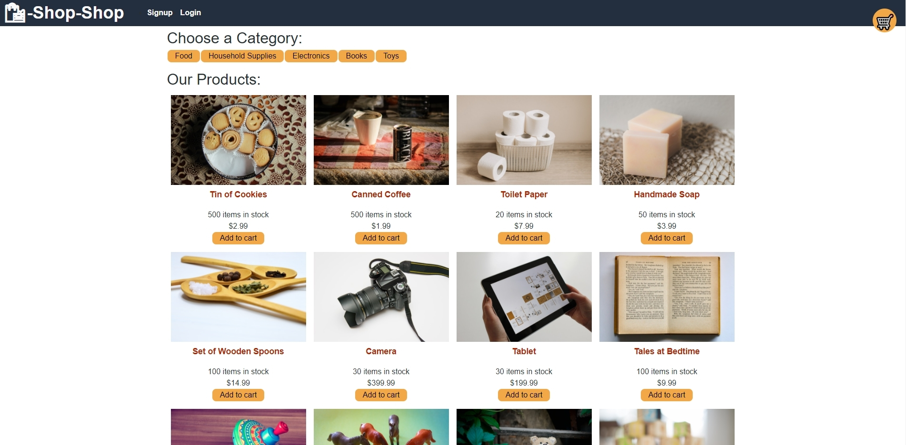

# ShopShop

## Description

This is a platform that allows business to sell products. The main page 
displays all products for the user to browes. They can create an account and must
do so before selecting products to purchase. Once done so and the use selects the products
they want to purchase it is then added to they're cart. Then if you go to purchase the products
it then utilizes Stripe to process payments. 

---

## Languages/API's

* Javascript
* CSS

* Stripe
* Express
* Node.js
* React
* Redux

## Screenshot

[Live site link](https://shopshop-project.herokuapp.com/)

